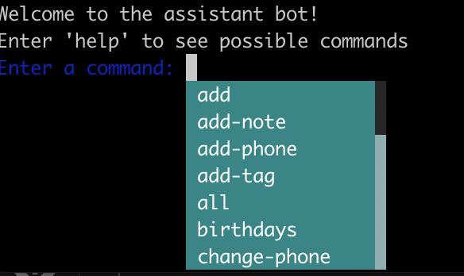
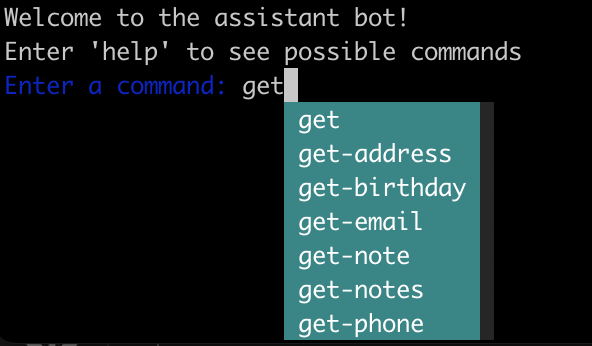
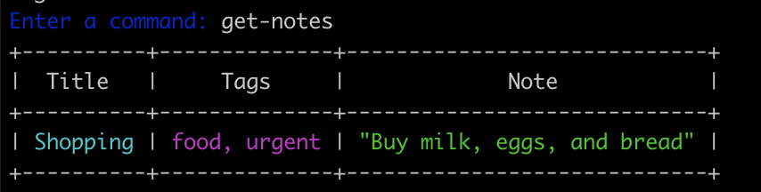

## Blue-line bot overview

This is a simple assistant CLI bots, that helps managing contacts and notes efficiently by offering various commands to add, retrieve, update, and remove information.


### Installation

The simplest way to launch the bot is to install it via `pip` and then use CLI runner `run_bot` to invoke the bot.

When installing via `pip`, all requirements will be installed automatically.

```bash
$ git clone https://github.com/leonovvv/goit-final-project
$ cd goit-final-project
$ pip install .
Processing /Users/azhpushkin/Projects/uni/goit-final-project
  Installing build dependencies ... done
  Getting requirements to build wheel ... done
  Preparing metadata (pyproject.toml) ... done
...
Successfully installed blue_line_bot-0.1
$ run_bot
Welcome to the assistant bot!
Enter 'help' to see possible commands
Enter a command:
```

You can also install directly from GitHub to avoid cloning repository:
```
$ pip install git+https://github.com/leonovvv/goit-final-project
$ run_bot
Welcome to the assistant bot!
...
```

For testing and development purposes, you can also launch the code directly as a Python executable package:
```bash
$ git clone https://github.com/leonovvv/goit-final-project
$ cd goit-final-project
$ pip install -r env/requirements.txt
$ python -m blue_line_bot
Welcome to the assistant bot!
Enter 'help' to see possible commands
Enter a command:
```

### Basic features

Bot provides functionality of the addressbook and notebook. 

As an addressbook, bot allows:
* Adding and storing contacts, which contain their name, email, phone, birthday and address
* Searching contacts by any of the mentioned attributes
* Editing and removing each attribute of a contact separately
* Removing whole contact

As an extra feature, addressbook can use provided dates of borth to find who is having birthdays soon (within specified timeframe).

As a notebook, bot allows:
* Creating and stroing notes, which contain note title, tags and contents
* Searching notes by any of the mentioned attributes
* Removing notes

Bot also provides **persistent storage** by saving all the data on the CLI exit, and restoring it on the next run. Addressbook and notebook are stored separately.


**To see all the commands and detailed arguments type `help` in the bot prompt**.

Bot also provides simple auto-complete functionality. Press tab in the prompt to show all the possible commands:



As you will type, list of commands will automatically adjust to auto-complete your input:



Bot also provides colored outputs and errors to improve visibility
and make inferface and messages more intuitive.

Example of colored notes output:


Example of colored error message:


### Simple usage Example

Addressbook demo:

```
$ run_bot
Welcome to the assistant bot!
Enter 'help' to see possible commands
Enter a command: hello
How can I help you?

Enter a command: add John_Doe 1234567890 john.doe@example.com 01.01.1990 "123 Elm Street, Springfield"
Contact added.

Enter a command: add Jane_Doe 0987654321 jane.doe@example.com 02.02.1992 "456 Oak Avenue, Springfield"

Contact added.
Enter a command: all
+----------+----------------------+------------+------------+-------------------------------+
|   Name   |        Email         |  Birthday  |   Phones   |            Address            |
+----------+----------------------+------------+------------+-------------------------------+
| John_Doe | john.doe@example.com | 01.01.1990 | 1234567890 | "123 Elm Street, Springfield" |
| Jane_Doe | jane.doe@example.com | 02.02.1992 | 0987654321 | "456 Oak Avenue, Springfield" |
+----------+----------------------+------------+------------+-------------------------------+


Enter a command: get phone 1234567890

+----------+----------------------+------------+------------+-------------------------------+
|   Name   |        Email         |  Birthday  |   Phones   |            Address            |
+----------+----------------------+------------+------------+-------------------------------+
| John_Doe | john.doe@example.com | 01.01.1990 | 1234567890 | "123 Elm Street, Springfield" |
+----------+----------------------+------------+------------+-------------------------------+

Enter a command: remove Jane_Doe
Contact removed

Enter a command: add-phone John_Doe 1122334455
Contact updated.

Enter a command: get-phone John_Doe
1234567890, 1122334455

Enter a command: change-phone John_Doe 1234567890 2233445566
Contact updated.

Enter a command: remove-phone John_Doe 1122334455
Phone removed.

Enter a command: all
+----------+----------------------+------------+------------+-------------------------------+
|   Name   |        Email         |  Birthday  |   Phones   |            Address            |
+----------+----------------------+------------+------------+-------------------------------+
| John_Doe | john.doe@example.com | 01.01.1990 | 2233445566 | "123 Elm Street, Springfield" |
+----------+----------------------+------------+------------+-------------------------------+

Enter a command: set-birthday John_Doe 15.03.1991
Birthday is set.

Enter a command: get-birthday John_Doe
15.03.1991

Enter a command: birthdays 5
There is no upcoming birthdays.

Enter a command: set-birthday John_Doe 18.08.1991
Birthday is set.

Enter a command: birthdays 5
Here are birthdays that will come in 5 days:
John_Doe - 19.08.2024

Enter a command: remove-birthday John_Doe 18.08.1991
Birthday removed.

Enter a command: birthdays 5
There is no upcoming birthdays.

Enter a command: get-address John_Doe
"123 Elm Street, Springfield"
```

Notesbook demo:

```
Enter a command: add-note Shopping "Buy milk, eggs, and bread"
Note added.

Enter a command: get-note title Shopping
+----------+------+-----------------------------+
|  Title   | Tags |             Note            |
+----------+------+-----------------------------+
| Shopping | ---  | "Buy milk, eggs, and bread" |
+----------+------+-----------------------------+

Enter a command: get-notes
+----------+------+-----------------------------+
|  Title   | Tags |             Note            |
+----------+------+-----------------------------+
| Shopping | ---  | "Buy milk, eggs, and bread" |
+----------+------+-----------------------------+

Enter a command: add-tag Shopping urgent
Tag added

Enter a command: add-tag Shopping food
Tag added

Enter a command: get-notes
+----------+--------------+-----------------------------+
|  Title   |     Tags     |             Note            |
+----------+--------------+-----------------------------+
| Shopping | food, urgent | "Buy milk, eggs, and bread" |
+----------+--------------+-----------------------------+

Enter a command: add-note Chores "Fix squeaky living room door"
Note added.

Enter a command: get-notes
+----------+--------------+--------------------------------+
|  Title   |     Tags     |              Note              |
+----------+--------------+--------------------------------+
| Shopping | food, urgent |  "Buy milk, eggs, and bread"   |
|  Chores  |    urgent    | "Fix squeaky living room door" |
+----------+--------------+--------------------------------+

Enter a command: get-note tags food
+----------+--------------+-----------------------------+
|  Title   |     Tags     |             Note            |
+----------+--------------+-----------------------------+
| Shopping | food, urgent | "Buy milk, eggs, and bread" |
+----------+--------------+-----------------------------+

Enter a command: exit
Good bye!
```